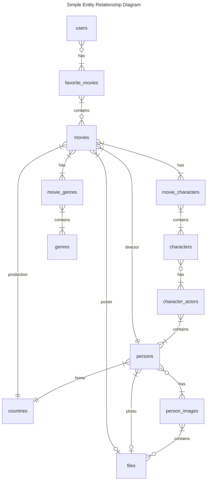
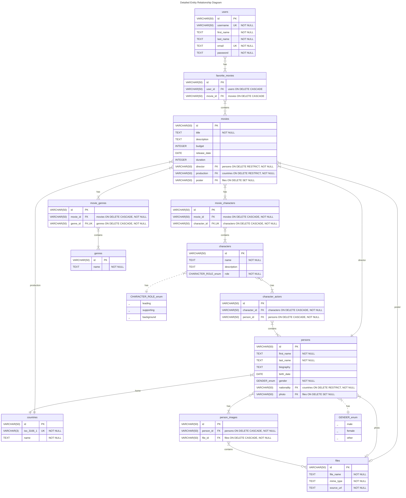

# BSA 2024 DB SQL

Binary Studio Academy "Javascript: Database and SQL" Lecture Homework.

- [Data Definiton](sql/data.sql)
- [Queries](sql/queries/)

## Entity Relationship Diagram

NOTE: Every tables has `created_at` and `updated_at` columns.

